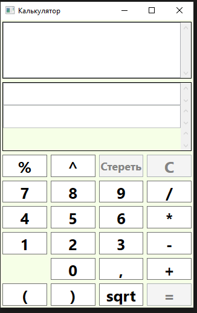
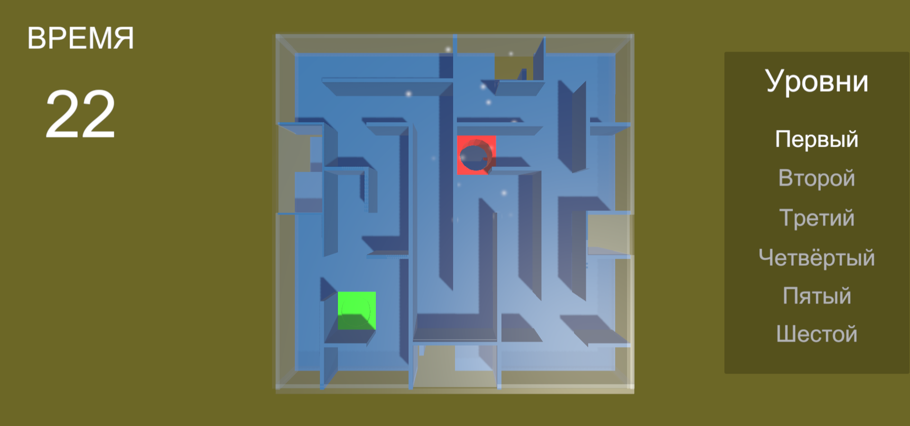
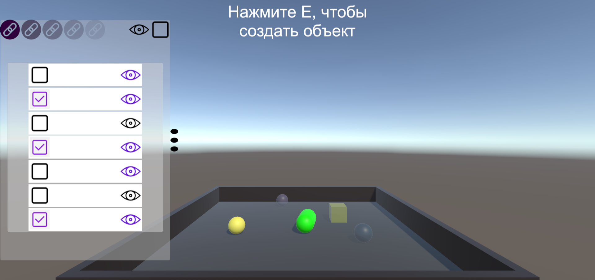
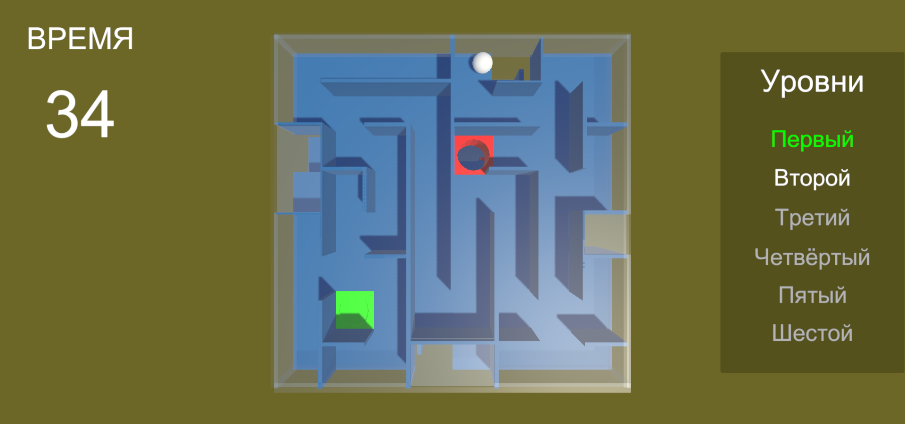
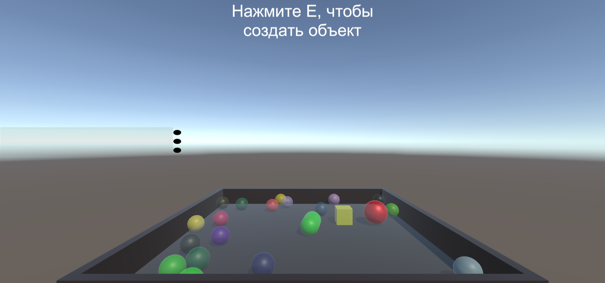
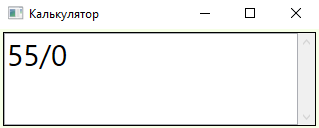
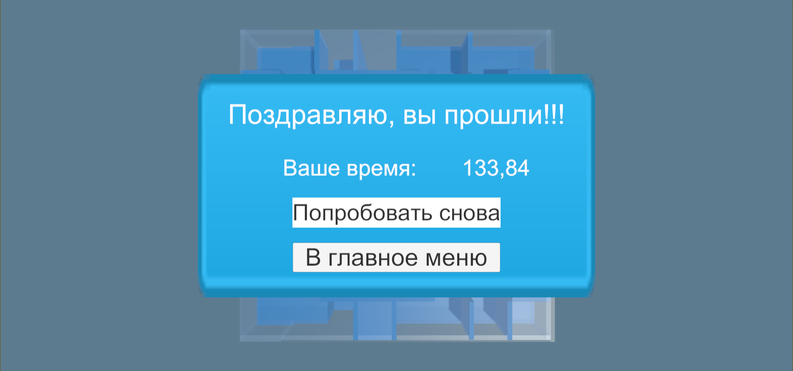

# Калькулятор на WPF
 В этом проекте сделан калькулятор с использованием технологии WPF и паттерна MVVM.  
 Калькулятор умеет работать с отрицательными и нецелыми числами, выполнять все основные математические операции (+, -, *, /), 
 а также вычислять корень, возводить число в степень, вычислять выражения в скобках, брать процент от числа.  
 Помимо ответа калькулятор ещё выводит выражение в формате обратной польской записи.  
 Само окошко калькулятора можно растягивать как вам нужно. Все элементы внутри окна также будут растягиваться.

 **Принцип работы с калькулятором:**  
 В верхнем блоке вводится арифметическое выражение. Причём выражение на этапе ввода обязательно будет корректным, то есть у вас не получится
 ввести два раза подряд операцию (например 3 +/ 5), или поставить ')' сразу после '('. Это сделано специально для того, чтобы избавиться 
 от ненужных ошибок.  
  
 Затем при нажатии на '=' в блоке ниже появляется запись арифметического выражения в формате обратной польской записи, а ещё ниже 
 сам результат. Но в случае, если на этапе вычисления выражения произошли ошибки (например деление на ноль), то ответа не будет, а в 
 самом нижнем блоке, специально отведённом под текст ошибки, появится сообщение какая ошибка была допущена.

 Ниже показаны скриншоты программы с разными тестами:
 -
 Стартовое окно калькулятора
 
  

 Тест 1. Введённое арифметическое выражение
 
  

 Тест 1. Обратная польская запись и результат
 
  

 Тест 2. Введённое арифметическое выражение
 
  

 Тест 2. Обратная польская запись и результат
 
  

 Тест 3. Введённое арифметическое выражение
 
  

 Тест 3. Обратная польская запись и сообщение об ошибке
 
  
