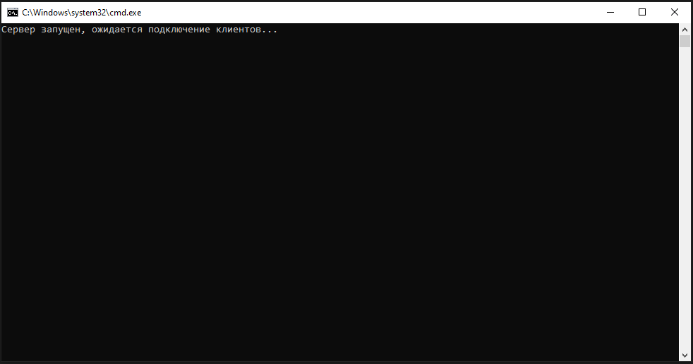
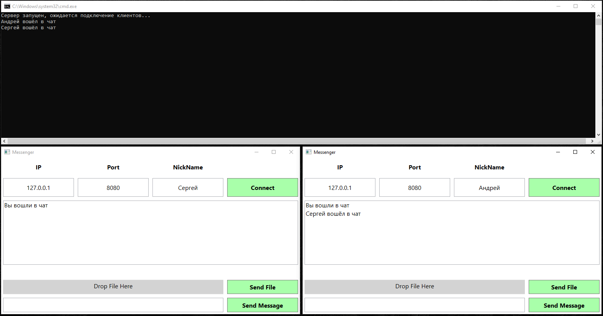

# TCP Мессенджер между двумя и более приложениями

В этом проекте я реализовал TCP мессенджер (клиент-серверное приложение).  
Сервер - это консольное приложение, а клиент - Wpf приложение, созданное с использованием паттерна MVVM.  
Клиент-серверное взаимодействие реализовано с использованием класса Socket из System.NET.Sockets.  
В мессенджере доступен чат, то есть можно отправлять сообщения. Но также помимо сообщений можно передавать и файлы.  
На примерах ниже будет показан весь процесс пользования мессенджером подробно:  

Сначала один раз запускаем проект ServerConsole. Вот какую консоль мы должны увидеть

Далее как минимум 2 раза запускаем проект ClientWpf, чтобы у нас было хотя бы 2 экземпляра клиента для наглядной работы. 
Вот как выглядит каждый из них.

Ip и Port у клиентов уже настроены на те, что используются на сервере. Вам нужно только ввести своё имя и нажать 
на кнопку Connect. Сделаем это у двух клиентов. Вот такой результат мы увидим: 

Отправим несколько сообщений. Для этого введите сообщение в поле внизу, а затем нажмите кнопку Send Message. 
Сообщения дублируются у двух клиентов в окне со всеми сообщениями, а также фиксируются на сервере.

А теперь отправим файлы. Для этого перетащите любой файл (но до 10мб) с вашего компьютера в поле с серым фоном, 
где написано Drop File Here. При успешном переносе вы увидите сообщение над этим полем с названием файла, который 
вы выбрали. Как перенесли файл, нажмите на кнопку Send File, чтобы отправить файл остальным участникам чата.

Файл появляется в папке, из которой запущен клиент. В моём случае это папка Debug:
  
Отправим ещё один файл от другого клиента: 

При отключении клиентов об этом оповещается сервер и выводит сообщения об их закрытии:

Таким образом была рассмотрена работа мессенджера. Стоит добавить, что окно для клиента можно расширять как вам удобно. 
Все элементы внутри будут расширяться или сужаться соответствующим образом.