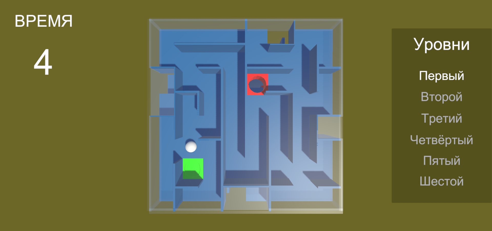
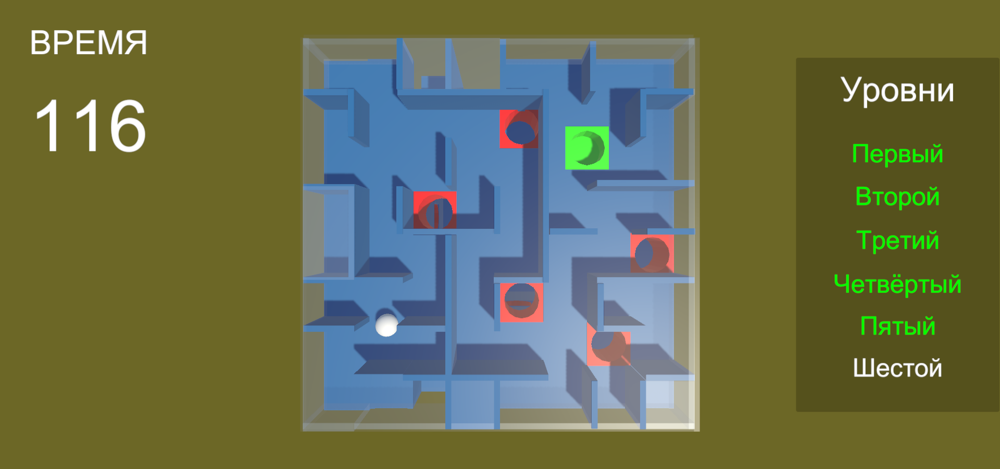

# Мини игра куб-лабиринт
В этой игре реализован 3D куб-лабиринт. Суть этой головоломки в том, чтобы, управляя шариком, 
пройти все 6 граней куба. Каждая грань соединена со следующей через один проход, который игроку нужно найти. 
Всё бы ничего, но на пути игрока будут встречаться отверстия (пропасти красного цвета). Упав в такую пропасть, 
игра начинается заново с первой грани (или первого уровня).  
На последней грани будет лунка зелёного цвета. Это и есть финиш, в котором останавливается игра и показывается время, 
за которое игрок прошёл все уровни.  

**Ниже на скриншотах игры будет всё показано:**  
Главное меню при запуске игры

Начало игры на первом уровне

Взрыв шарика, если упасть в красное отверстие, и последующий рестарт игры

Меню паузы

Меню настроек

Шарик находится перед переходом на следующий уровень

Второй уровень (справа зелёным стал помечен первый уровень, так как он уже пройден)

Шестой уровень

Финиш (зелёная лунка)

Весь куб целиком

  

