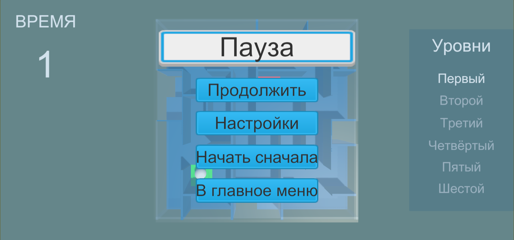
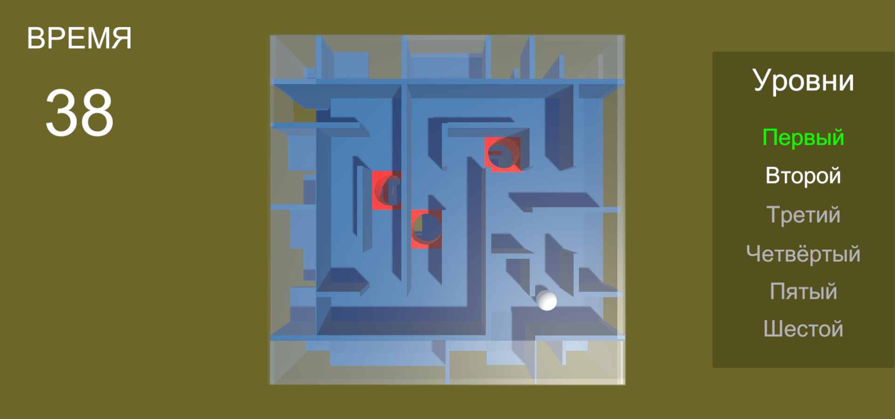

# Интерфейс для объектов на сцене

 В этом проекте создан интерфейс, через который можно управлять объектами на сцене.  
 Есть сцена, и на ней по умолчанию есть 3 объекта. Также при нажатии на клавишу 'E' создаются новые объекты (сферы разного цвета).  
 И для каждого объекта (для исходных 3 и для всех новых) в интерфейсе создаётся новая ячейка с кнопками управления для него.  
 Кнопки управления:  
 1) кнопка в виде глазика позволяет скрыть или показать объект на сцене
 2) кнопка в виде чекбокса отмечает объект или снимает пометку

 На все помеченные объекты, у которых в чекбоксе стоит галочка, действуют кнопки вверху слева, позволяющие сменить прозрачность.  
 Также вверху справа есть кнопки из 1 и 2 пункта, но их эффект действует сразу на все объекты, а не только на один.  

 Интерфейс управления объектами можно скрыть либо открыть, если нажать на 3 точки справа от него. При создании большого количества объектов, 
 элементы в списке на интерфейсе можно проматывать вверх или вниз.

 **Ниже на примерах показана работа программы:**  

 Старт приложения. На сцене 3 объекта.
 
 Было добавлено 4 объекта. из 7 объектов выделены 3, у которых была изменена прозрачность.
 
 Два объекта скрыты с помощью глазика.
 
 Добавлено ещё больше объектов, все они видны и у всех изменена прозрачность.
 
 Скрытие интерфейса на 3 точки.
 
 Открытие меню паузы при нажатии на клавишу 'Escape'
 